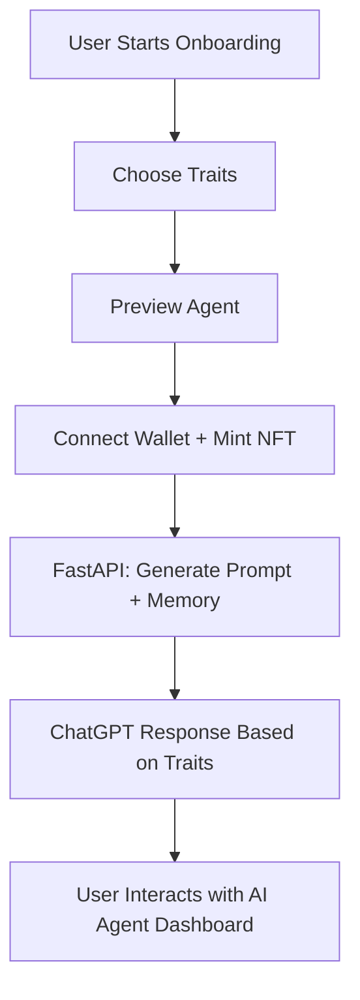

# 🤖 Docca — The AI Agent You Own

**Docca** is a Web3-native platform where users can create, customize, and own AI agents powered by ChatGPT — all backed by Solana NFTs. It blends gamified onboarding, modular AI behavior, and crypto-native ownership into one seamless experience.


---

## 🚀 Project Status

> Docca is currently in early planning and research phase.

- ✅ Stack decided: **React (frontend)** + **Solana/Web3 (NFTs)** + **Python (FastAPI backend)**
- 🧠 Core concept: Users create an AI agent (via onboarding), traits affect ChatGPT personality
- 🧱 Goal: Use smart contracts for agent ownership; OpenAI + FastAPI for AI behavior
- ⏳ Development has not yet started

---

## ✨ Planned Features

### 🧠 AI Agent Customization

Users will define agent characteristics:

- **Tone** (e.g., witty, professional, chill)
- **Purpose** (e.g., assistant, trading bot, support agent)
- **Name & Avatar**

These traits are used to shape ChatGPT behavior via dynamic system prompts.

### 🎨 Gamified Onboarding Flow

- Step-by-step wizard to define traits
- AI preview before minting
- Story-driven UI to immerse users

### 🔗 Web3 Integration (Solana)

- Users connect Solana wallet (e.g., Phantom)
- Agent is minted as NFT on-chain
- Traits stored in metadata or linked via IPFS
- Ownership gated access to agent features

### 🧠 AI Interaction & Memory

- Backend (FastAPI) handles:

  - Agent profile generation
  - ChatGPT API interaction
  - Memory storage (Redis/PostgreSQL)

- Agents may evolve or gain new traits

---

## 🧰 Planned Tech Stack

| Layer      | Technology                                     |
| ---------- | ---------------------------------------------- |
| Frontend   | React + Tailwind + Wallet Adapter              |
| AI Backend | Python + FastAPI + OpenAI SDK                  |
| Blockchain | Solana (NFTs via Metaplex/JS SDK)              |
| Storage    | IPFS (via nft.storage or Pinata)               |
| DB/Memory  | PostgreSQL + Redis (optional)                  |
| Auth       | Wallet signature verification                  |
| Testing    | Pytest (backend), Vitest/Playwright (frontend) |

---

## 🧱 Future Architecture Overview



---

## 📁 Project Structure (Planned)

```bash
/docca
├── clients
│   └── react             # React UI with onboarding + wallet connect
├── backend
│   └── fastapi           # Python backend for agent logic and chat
├── contracts
│   └── solana            # Solana minting smart contracts (optional)
├── tests
│   ├── frontend          # Component and E2E tests (Vitest/Playwright)
│   └── backend           # FastAPI unit and integration tests (pytest)
├── assets                # Logos, trait art, banners
├── docs                  # Technical docs, prompt design, metadata schemas
└── README.md
```

---

## 📌 Goals for Initial Prototype

- [ ] Onboarding UI (React)
- [ ] Connect Wallet (Phantom)
- [ ] Trait selector + AI preview
- [ ] FastAPI backend with OpenAI integration
- [ ] Mint NFT with agent traits
- [ ] Upload metadata to IPFS
- [ ] Display agent chat interface gated by ownership
- [ ] Write unit and integration tests for backend API
- [ ] Add UI component and E2E tests

---

## 🔐 Authentication Plan

### 🔑 Auth Flow Overview

Docca uses a **wallet-based authentication flow** to verify ownership of AI agents and gate access to personalized AI interactions.

### 🧾 Step-by-Step Auth Flow

1. **User Connects Wallet**

   - React frontend uses Solana Wallet Adapter (e.g., Phantom, Backpack)

2. **Generate Nonce for Signature**

   - Frontend requests a nonce from the FastAPI backend
   - Example endpoint: `GET /auth/nonce?wallet=...`

3. **User Signs Nonce**

   - The frontend requests the wallet to sign the nonce
   - Signature proves control of the private key

4. **Backend Verifies Signature**

   - FastAPI backend verifies the signature using Solana’s `PublicKey.verify()` method
   - If valid, it issues a session token (JWT or custom header)

5. **Restrict Access Based on NFT Ownership**

   - Backend checks whether the connected wallet owns a valid Docca Agent NFT
   - Only owners can:

     - Access the chat endpoint
     - Modify agent settings
     - View agent memory or logs

6. **Guest Mode (Optional)**

   - Allow limited interactions without wallet
   - Traits and chat are not persisted

### 🛡️ Security Notes

- All signatures are verified server-side
- Session tokens are short-lived and bound to wallet addresses
- No passwords, emails, or traditional login flows needed
- Optionally integrate rate-limiting and signature revalidation

---

## 🧭 User Flow

```mermaid
graph TD
    A[User visits Docca landing page] --> B[Clicks 'Apply Now']
    B --> C[Onboarding begins: Choose traits]
    C --> D[Agent preview powered by ChatGPT]
    D --> E[Connect wallet]
    E --> F[Sign nonce to authenticate]
    F --> G[Mint NFT with agent traits to Solana]
    G --> H[Access AI agent dashboard (chat, memory)]
    H --> I[Ongoing: Interact, evolve agent, unlock features]
```

---

## 📖 Documentation Plans

- [ ] `prompt-design.md`: How system messages are built
- [ ] `minting-process.md`: NFT metadata & minting logic
- [ ] `agent-structure.json`: Metadata schema for agent NFTs
- [ ] `api-spec.md`: Endpoints for chat, memory, and traits
- [ ] `testing.md`: Test strategy for frontend and backend

---

## 📅 Roadmap

### Milestone 1 — Proof of Concept

- Wallet connect
- Trait selection
- ChatGPT response preview

### Milestone 2 — NFT Integration

- IPFS metadata upload
- Solana NFT minting with traits
- Owner-gated agent interaction

### Milestone 3 — AI Memory & Evolution

- Store logs / memory
- Upgrade agent traits
- Display agent profile + history
- Add full test coverage for core flows

---

## 📝 License

MIT © 2025 — The Docca Project
